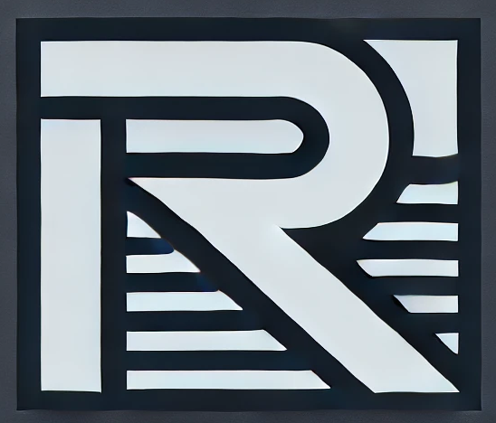

# RAMP: R for AutoMatization and Packaging 

*Proposed date: Friday, late April 2025*

## Description

This workshop offers a dive into programming in R, focusing on automating repetitive tasks and packaging code for reuse. 
Participants will explore techniques to streamline their workflows, making data analysis more efficient and reproducible.

The first part of the workshop will cover automation techniques, including using loops to handle spatial data science tasks such as model calculations and map creation across multiple input files. 
Participants will also learn to write functions that encapsulate code and efficiently apply them to multiple inputs using the **purrr** package. 
Additionally, a brief discussion on parallel computing will demonstrate how to speed up processing time.

Building on these skills, the second part of the workshop will focus on creating R packages. 
Participants will learn how to structure their code into reusable packages, write proper documentation, and enhance reproducibility and collaboration.

This workshop blends lectures with hands-on exercises. 
Each topic will begin with a concise lecture, followed by guided exercises to reinforce learning. 
By the end, participants will have practical experience in automating tasks, organizing their code efficiently, and sharing their work effectively with others.

## Prerequisites

Participants should have a basic understanding of R.

## Instructor

[Jakub Nowosad](https://jakubnowosad.com/) Ph.D. is an associate professor at Adam Mickiewicz University in Poznań, Poland and a visiting scientist at the University of Münster, Germany.
He is a computational geographer whose work bridges geocomputation and environmental sciences. 
A key aspect of his work involves creating, collaborating on, and enhancing geocomputational software. 
Jakub is an active member of the #rspatial community and has co-authored the books Geocomputation with R and Geocomputation with Python.